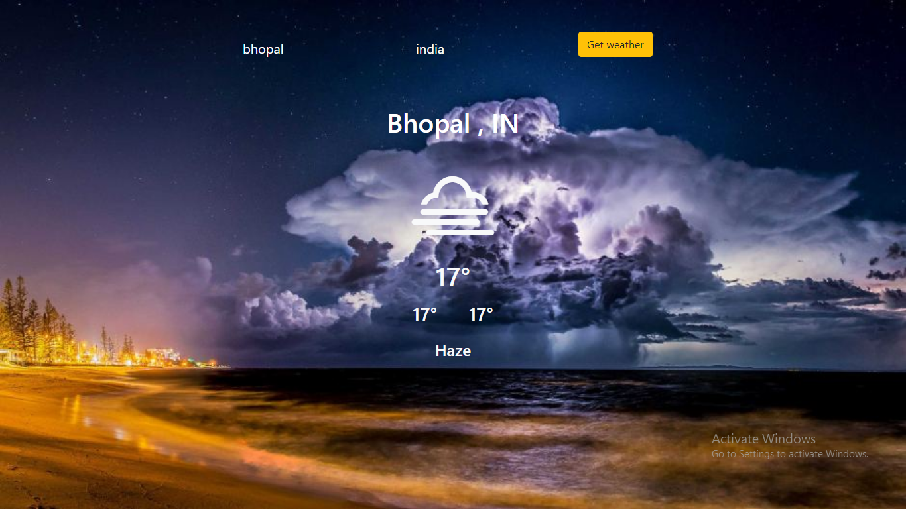

# Weather App in ReactJS



This is an app which tells the-

- current weather
- min temp
- max temp
- description of the weather

The api is used for fetching the data

## clone the project

```
git clone https://github.com/shivkaansh/WeatherApp-Reactjs.git
cd WeatherApp-Reactjs
npm i
npm start
```


